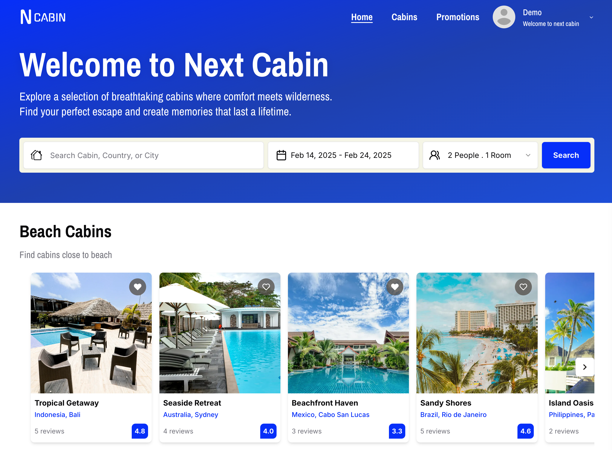

# NextCabin

A modern cabin reservation platform built with Next.js.



[Live Demo](https://next-cabin-app.vercel.app/)

NextCabin is a web application designed for booking and managing cabin reservations. It provides a seamless experience for users to explore, reserve, and manage stays in remote cabins. Built with Next.js, it ensures high performance, scalability, and a smooth user experience.

## Features

- Cabin Listings – Browse available cabins with detailed descriptions and images.
- Reservation System – Book your stay with real-time availability checks.
- User Authentication – Secure login and account management.
- User Dashboard – Manage bookings, users, and cabin details.
- Responsive UI – Optimized for all devices.
- Advanced Filtering System – Easily find cabins using filters such as types, price range, and facilities.
- Interactive Map – Integrated with **Leaflet** to display cabin locations, allowing users to explore available cabins on a dynamic map.  
- Cabin Reviews – Users can leave reviews and ratings for cabins.
- Cabin Favorites – Users can mark cabins as favorites to easily access them later for future bookings.  


## Getting Started

### Prerequisites

Ensure you have Node.js and a package manager installed (npm, yarn, pnpm, or bun).

### Installation

Clone the repository and install dependencies:

```bash
git clone https://github.com/MSaeedMp/next-cabin-app.git
cd nextcabin
npm install  # or yarn install or pnpm install or bun install
```
